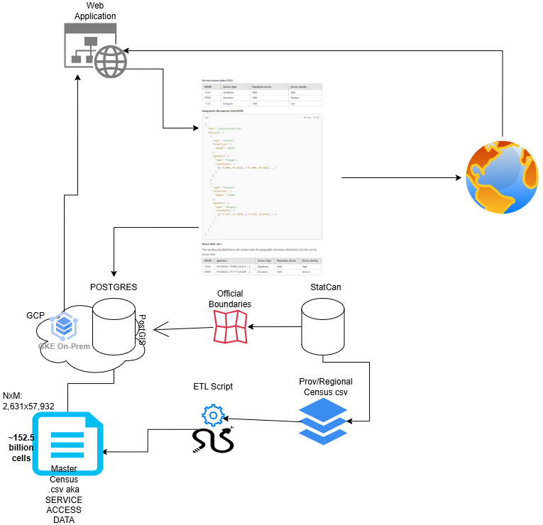

# Spatial Analysis Tool

Goal - Move Zach's files to GitHub and deploy to Cloud Run

## Changes 

- added packages to pyproject.tomls
- containerized with Docker
- added cloudbuild.yamls for deployment (trigger not yet added)
- changed to use gunicorn rather than flask's built in-server for performance and reliability 